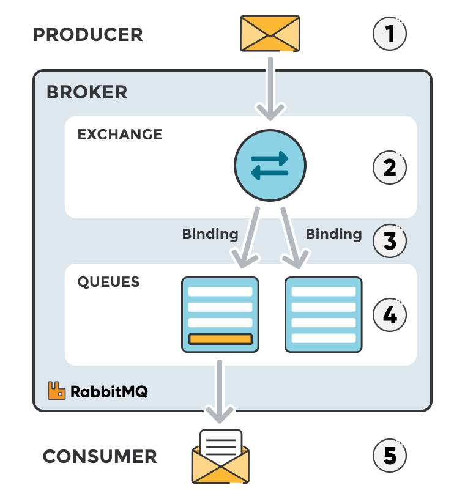

# RabbitMQ

This guide offers a concise overview of RabbitMQ exchanges and topics, designed to assist users of the [Novel Observing Strategies Testbed (NOS-T)](https://github.com/code-lab-org/nost-tools).

> **Note:**
> This guide closely follows the [CloudAMQP guide](https://www.cloudamqp.com/blog/part4-rabbitmq-for-beginners-exchanges-routing-keys-bindings.html), which provides detailed information about RabbitMQ exchanges, routing keys, and bindings.

## Standard RabbitMQ Message Flow

The typical RabbitMQ message flow works as follows:

1. The producer sends a message to the exchange.
2. The exchange receives the message and takes charge of routing it.
3. Bindings must be established between the exchange and the queues. In this scenario, the exchange routes the message to two different queues.
4. Messages remain in the queue until they are processed by a consumer.
5. The consumer processes the message.

<i>A typical RabbitMQ message flow: A producer sends a message, which is eventually processed by a consumer.</i>

## 