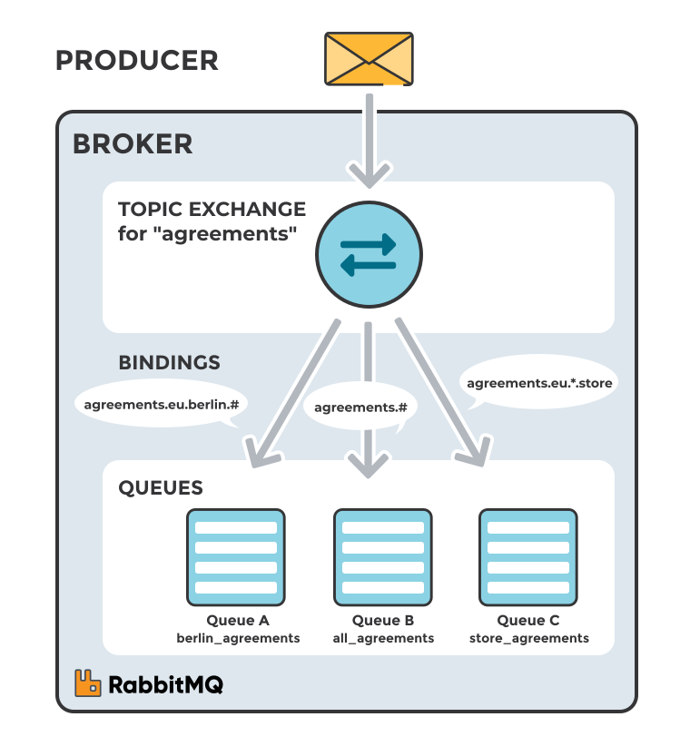

# RabbitMQ

## Contents
1. [Background](#background)
1. [Standard RabbitMQ Message Flow](#standard-rabbitmq-message-flow)
1. [Topic Exchange](#topic-exchange)

## Background

[RabbitMQ](https://www.rabbitmq.com/) is a robust, open-source message broker that facilitates communication between different applications or components by sending and receiving messages. It implements the Advanced Message Queuing Protocol (AMQP) and supports various messaging patterns, including point-to-point, publish/subscribe, and request/reply.

This guide offers a concise overview of RabbitMQ exchanges and topics, designed to assist users of the [Novel Observing Strategies Testbed (NOS-T)](https://github.com/code-lab-org/nost-tools).

> **Note:**
> This guide closely follows the [CloudAMQP guide](https://www.cloudamqp.com/blog/part4-rabbitmq-for-beginners-exchanges-routing-keys-bindings.html), which provides detailed information about RabbitMQ exchanges, routing keys, and bindings.

---

## Standard RabbitMQ Message Flow

The typical RabbitMQ message flow works as follows:

1. The producer sends a message to the exchange.
2. The exchange receives the message and takes charge of routing it.
3. Bindings must be established between the exchange and the queues. In this scenario, the exchange routes the message to two different queues.
4. Messages remain in the queue until they are processed by a consumer.
5. The consumer processes the message.

<i>A typical RabbitMQ message flow: A producer sends a message, which is eventually processed by a consumer.</i>

---

## Topic Exchange

Topic exchanges route messages to queues based on wildcard matches between the routing key and the routing pattern specified by the queue binding. Messages are routed to one or many queues based on this match.

- **Routing Key**: A list of words delimited by periods (e.g., `agreements.us`, `agreements.eu.stockholm`).

- **Routing Patterns**: 
  - An asterisk (`*`) matches a word in a specific position (e.g., `agreements.*.*.b.*` matches keys where the first word is "agreements" and the fourth word is "b").
  - A pound symbol (`#`) matches zero or more words (e.g., `agreements.eu.berlin.#` matches keys starting with `agreements.eu.berlin`).

Consumers subscribe to topics by creating a queue and setting up a binding with a routing pattern to the exchange. Messages with matching routing keys are routed to the queue and stay there until consumed.

The default exchange for topic exchanges in AMQP brokers is `amq.topic`.

<i>A topic exchange where messages are routed to one or many queues based on a match between a message routing key and the routing pattern.</i>

**Scenario 1: Consumer A**
- **Interest**: All agreements in Berlin
- **Exchange**: `agreements`
- **Queue A**: `berlin_agreements`
- **Routing Pattern**: `agreements.eu.berlin.#`
- **Matching Keys**: `agreements.eu.berlin`, `agreements.eu.berlin.store`

**Scenario 2: Consumer B**
- **Interest**: All agreements
- **Exchange**: `agreements`
- **Queue B**: `all_agreements`
- **Routing Pattern**: `agreements.#`
- **Matching Keys**: `agreements.eu.berlin`, `agreements.us`

**Scenario 3: Consumer C**
- **Interest**: All agreements for European head stores
- **Exchange**: `agreements`
- **Queue C**: `store_agreements`
- **Routing Pattern**: `agreements.eu.*.store`
- **Matching Keys**: `agreements.eu.berlin.store`, `agreements.eu.stockholm.store`

---