# Setting up RabbitMQ on Local Host with Keycloak as OAuth 2.0 server

## Background

Originally, NOS-T was designed to utilize the Solace PubSub+ Standard Edition event broker with the Message Queuing Telemetry Transport (MQTT) protocol. However, it has now transitioned to using RabbitMQ with the Advanced Message Queuing Protocol (AMQP) protocol.

This page shows how to configure a new standalone RabbitMQ broker on a local host such as a personal machine or a secure local network. The tutorial mostly mirrors the rabbitmq [rabbitmq-oauth2-tutorial guide](https://github.com/rabbitmq/rabbitmq-oauth2-tutorial/tree/main) which provides instructions and tools to get a RabbitMQ message broker Docker container up-and-running on a desktop using Docker Compose, a tool for defining and running multi-container Docker applications. While the capabilities of a locally hosted broker are more limited, it is useful for becoming familiar with the RabbitMQ interface and experimenting with publisher/subscriber behaviors.

## Motivation

The transition from Solace PubSub+ Standard Edition to RabbitMQ was primarily driven by RabbitMQ's advanced queueing capabilities and its open-source nature. Furthermore, updates to NASA's Science Managed Cloud Environment (SMCE) requirements now include two-factor authentication (2FA). Keycloak, an Identity and Access Management (IAM) software, was chosen as the OAuth 2.0 provider due to its open-source nature and robust 2FA capabilities.

## OAuth 2.0 Authentication Workflow

When an end user first accesses the management user interface and clicks the "Click here to login" button, they are redirected to the OAuth 2.0 provider for authentication. After successfully authenticating, the user is redirected back to RabbitMQ with a valid JWT token. RabbitMQ then validates the token, identifies the user, and extracts their permissions from the JWT token.

> **Note:**
> The token is passed as a parameter to RabbitMQ commands. However, the connection cannot be used beyond the token’s lifespan, so token refresh is necessary for long-lived connections.


<p align="center">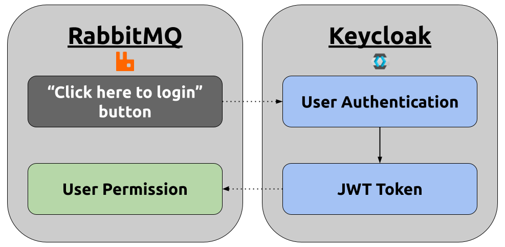</p>
<p align="center"><i>OAuth 2.0 workflow integrating RabbitMQ as the event broker and Keycloak as the IAM and OAuth 2.0 provider.</i></p>

## Keycloak & RabbitMQ Setup Instructions

Below are instructions for configuring and deploying Keycloak and RabbitMQ.

### Prerequisites

This guide requires the following software to be installed and operational:

- [Docker](https://www.docker.com/get-started/)
- [make](https://www.geeksforgeeks.org/how-to-install-make-on-ubuntu/)

> **Note:**
> Click on the software name for more directions on their installation.

### Clone GitHub Repository

To begin setting up a RabbitMQ broker, clone the [rabbitmq-oauth2-tutorial](https://github.com/rabbitmq/rabbitmq-oauth2-tutorial/tree/main) GitHub repository:

```bash
git clone git@github.com:rabbitmq/rabbitmq-oauth2-tutorial.git
```

### Deploy Keycloak

To deploy a Keycloak broker, run:

```bash
make start-keycloak
```

> **Note:**
> The above command will launch Keycloak with all the required scopes, users and clients preconfigured. Keycloak comes configured with its own signing key, and the [rabbitmq.conf](https://github.com/rabbitmq/rabbitmq-oauth2-tutorial/blob/main/conf/keycloak/rabbitmq.conf) used by ```make start-keycloak``` is also configured with the same signing key.


To access the Keycloak Administration Console, a management interface, navigate to http://localhost:8080.
<!--  -->

<p align="center">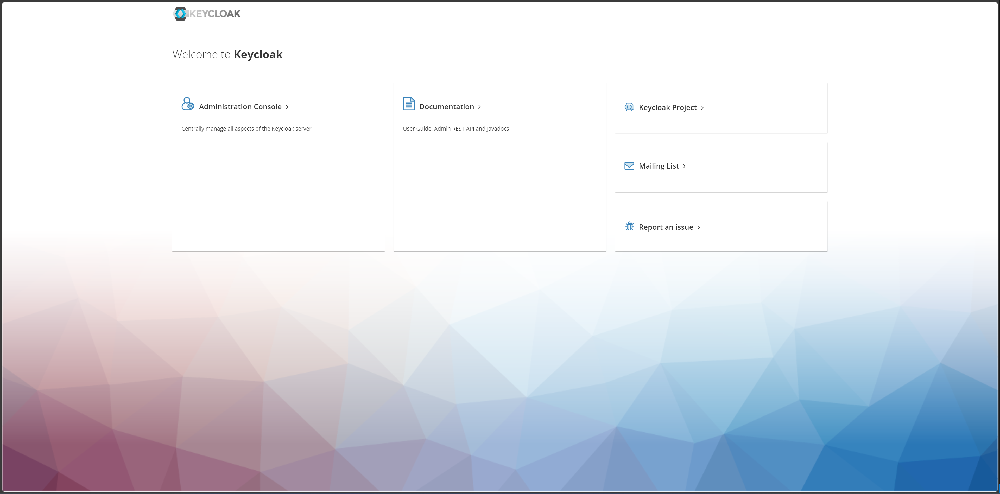</p>
<p align="center"><i>The Keycloak Administration Console enables administrators to manage scopes, users and clients.</i></p>

Click on "Administration Console," which will prompt a login screen. Enter the following credentials:

- Username: admin
- Password: admin

<p align="center">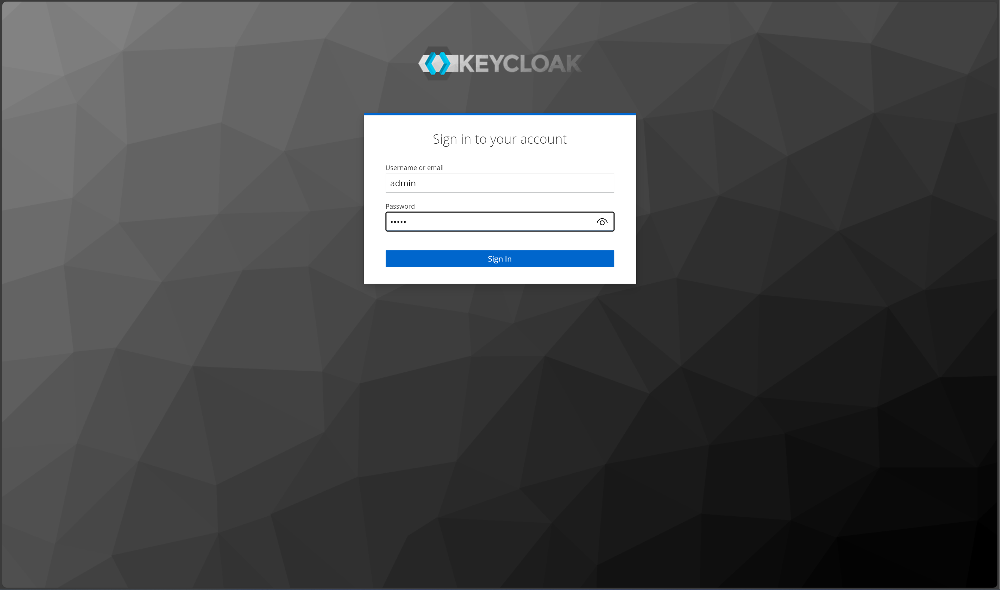</p>
<p align="center"><i>The Keycloak Administration Console login screen.</i></p>

There is a dedicated Keycloak realm called ```test``` that is configured with the following three clients:

- ```rabbitmq-client-code``` for the rabbitmq managament ui
- ```mgt_api_client``` to access via the management api
- ```producer``` to access via AMQP protocol.

### Deploy RabbitMQ

To start RabbitMQ run the following two commands:

```bash
export MODE=keycloak
make start-rabbitmq
```

The first commands directs RabbitMQ to be configured using the [rabbitmq.conf](https://github.com/rabbitmq/rabbitmq-oauth2-tutorial/blob/main/conf/keycloak/rabbitmq.conf) file. Below is an example of the contents of this file:

#### RabbitMQ Configuration

```
auth_backends.1 = rabbit_auth_backend_oauth2

log.default.level = debug

management.oauth_enabled = true
management.oauth_client_id = rabbitmq-client-code
management.oauth_scopes = openid profile rabbitmq.tag:administrator
management.oauth_provider_url = http://localhost:8080/realms/test

auth_oauth2.resource_server_id = rabbitmq
auth_oauth2.preferred_username_claims.1 = user_name
auth_oauth2.additional_scopes_key = extra_scope
auth_oauth2.issuer = https://keycloak:8443/realms/test
auth_oauth2.https.peer_verification = verify_none
```

- Authentication Backend:
    - auth_backends.1 = rabbit_auth_backend_oauth2: This line sets RabbitMQ to use OAuth2 as the authentication backend. This is essential for integrating RabbitMQ with OAuth2 providers like Keycloak.

- Logging:
    - log.default.level = debug: This sets the logging level to debug, which is useful for troubleshooting and ensuring that the OAuth2 integration is working correctly.

- Management Plugin Configuration:
    - management.oauth_enabled = true: Enables OAuth2 authentication for the RabbitMQ management plugin.
    - management.oauth_client_id = rabbitmq-client-code: Specifies the OAuth2 client ID used by RabbitMQ to authenticate with the OAuth2 provider.
    - management.oauth_scopes = openid profile rabbitmq.tag:administrator: Defines the scopes required for OAuth2 authentication. These scopes determine the level of access granted to the authenticated user.
    - management.oauth_provider_url = http://localhost:8080/realms/test: Specifies the URL of the OAuth2 provider (in this case, Keycloak).

- OAuth2 Resource Server Configuration:
    - auth_oauth2.resource_server_id = rabbitmq: Sets the resource server ID for RabbitMQ.
    - auth_oauth2.preferred_username_claims.1 = user_name: Defines the claim used to extract the preferred username from the OAuth2 token.
    - auth_oauth2.additional_scopes_key = extra_scope: Specifies additional scopes that might be required.
    - auth_oauth2.issuer = https://keycloak:8443/realms/test: Sets the issuer URL for the OAuth2 tokens, ensuring they are validated correctly.
    - auth_oauth2.https.peer_verification = verify_none: Disables peer verification for HTTPS, which can be useful in development environments but should be used with caution in production.

#### RabbitMQ Management User Interface

To access the RabbitMq management user interface, navigate to http://localhost:15672/#/.

<p align="center"></p>
<p align="center"><i>The RabbitMQ management user interface.</i></p>

Click on "Click here to log in" button, which will prompt a login screen. Enter the following credentials:
- Username: rabbit_admin
- Password: rabbit_admin

<p align="center">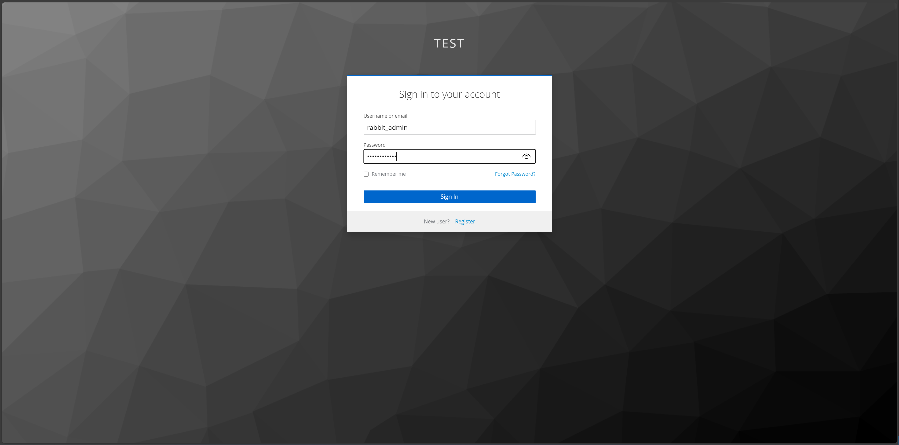</p>
<p align="center"><i>The RabbitMQ management user interface login screen.</i></p>

> **Note:**
> The ```rabbit_admin``` is the single user created in Keycloak with the appropriate scopes to access the management user interface.

## Manage Authentication

### Create a New User

The Keycloak Administration Console allows you to manage scopes, users and clients. In this section, we will add a new user that is able to access the RabbitMQ event broker.

Navigate to http://localhost:8080. Click on "Administration Console," which will prompt a login screen. Enter the following credentials:

- Username: admin
- Password: admin

Ensure you are in the ```test``` realm. Then, navifate to "Users" > "Add user." Fill in the fields, then click "Create."

<p align="center">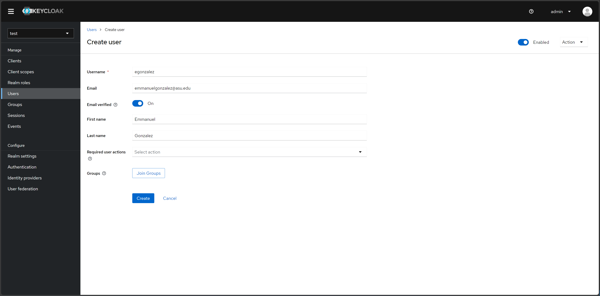</p>
<p align="center"><i>Creating a user in the test realm.</i></p>

After creating the user, navigate to "Credentials" > "Set password," which will prompt you to create a password for the new user.

<p align="center">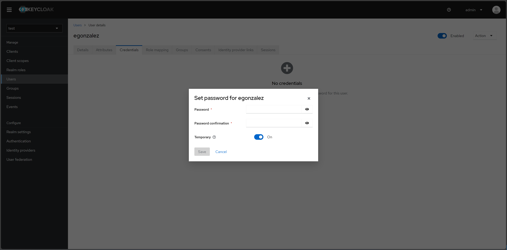</p>
<p align="center"><i>Creating a password for the new user in the test realm.</i></p>

### Assign Roles to User

The user must be granted the necessary roles. To do this, navigate to "Users" > "Role mapping" > "Assign role". 

<p align="center">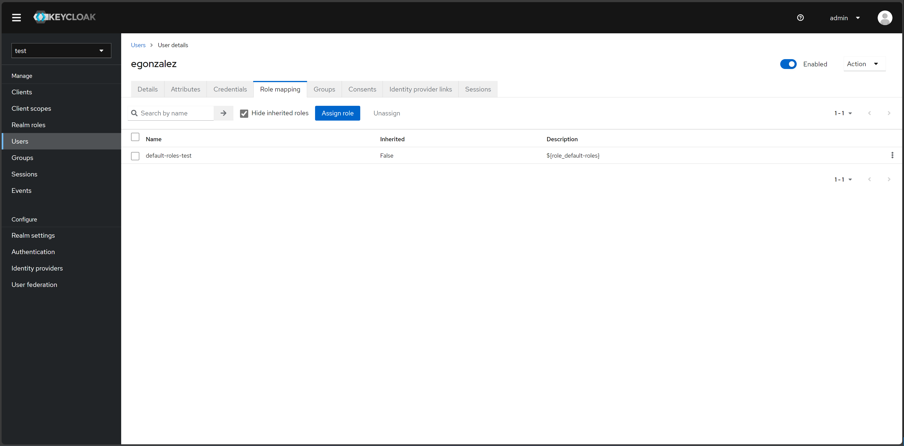</p>
<p align="center"><i>Role mapping management in Keycloak.</i></p>

Add the following roles to your new user:
- rabbitmq.tag:administrator
- rabbitmq.configure:*/*
- rabbitmq
- rabbitmq.write:*/*
- rabbitmq.read:*/*

Once selected, click "Assign."

<p align="center">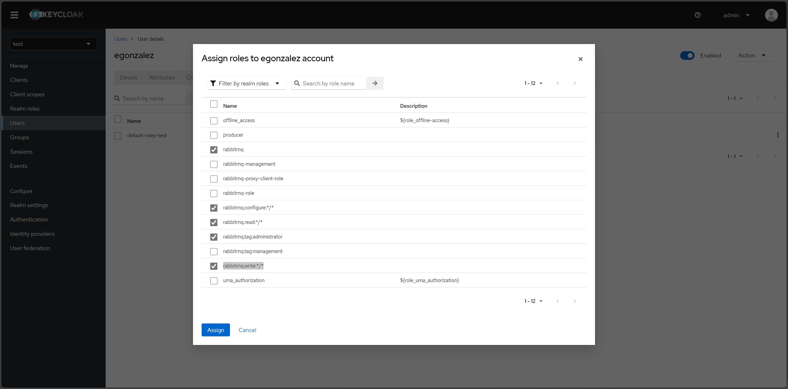</p>
<p align="center"><i>Assign roles to a user in Keycloak.</i></p>

### Set Up Two-Factor Authentication

To set up 2FA using a One-Time Password (OTP), navigate to "Authentication" > "Required actions" > Enable "Configure OTP."

<p align="center">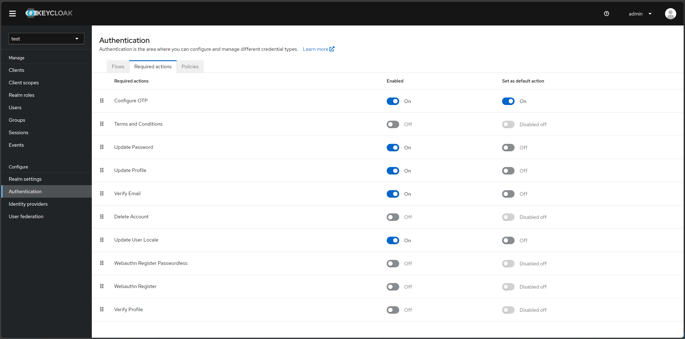</p>
<p align="center"><i>Assign roles to a user in Keycloak.</i></p>

### Configuring OTP

The user must configure their 2FA application. They can do this the first time they access your application, in this case RabbitMQ.

Navigate to http://localhost:15672/#/:

<p align="center"></p>
<p align="center"><i>The RabbitMQ management user interface.</i></p>

Click on "Click here to log in" button, which will prompt a login screen. Enter the credentials of your new user:

<p align="center">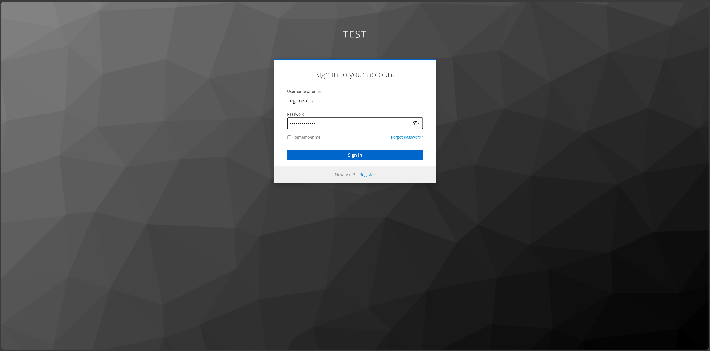</p>
<p align="center"><i>Logging into RabbitMQ using Keycloak authentication page.</i></p>

The user will be prompted to set up a 2FA application. Scan the QR code using the Google Authenticator or FreeOTP apps, get a one-time code, and name the device.

> **Note:**
> Keycloak supports both Google Authenticator and FreeOTP.

<p align="center">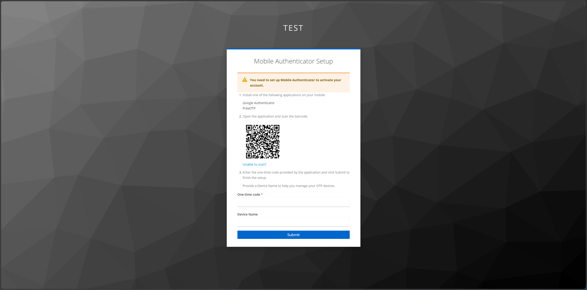</p>
<p align="center"><i>Prompt to set up 2FA application on Keycloak.</i></p>

Once the user completes the set up, they will have access to RabbitMQ.

<p align="center">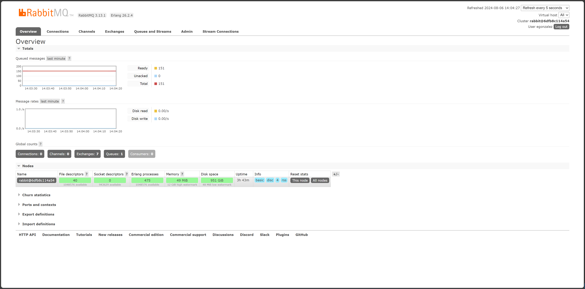</p>
<p align="center"><i>Successful login using 2FA on Keycloak to access RabbitMQ event broker.</i></p>

### Account Management

The Keycloak Account Management user interface enables users to manage their Authenticator applications.

Navigate to http://localhost:8080/realms/test/account/#

<p align="center">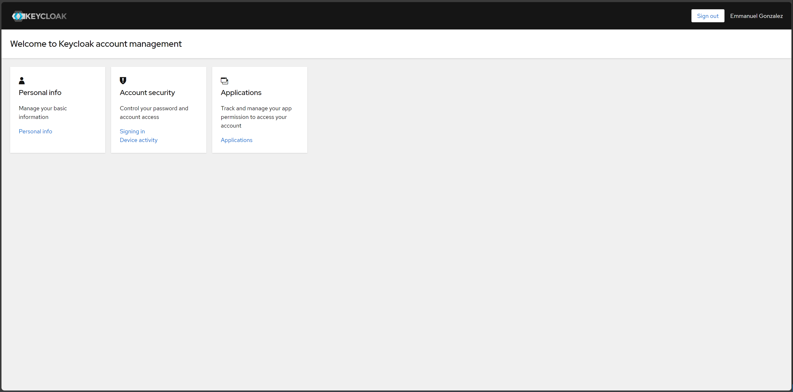</p>
<p align="center"><i>Keycloak account management user interface.</i></p>

To manage 2FA applications, navigate to "Signing in" > "Two-factor authentication."

<p align="center">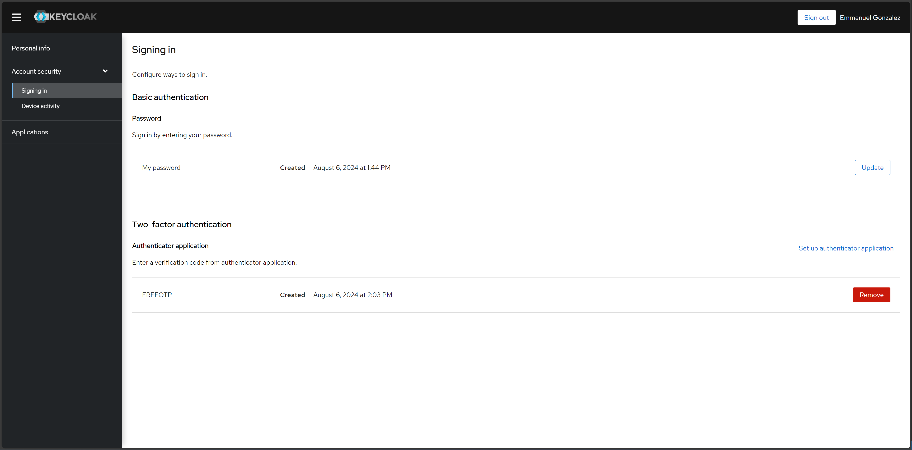</p>
<p align="center"><i>Keycloak account management user interface sign in settings, including 2FA.</i></p>

## Testing Keycloak Authentication for RabbitMQ

### Configuring User Roles for OAuth 2.0 and 2FA

To test OTP-based 2FA, you must install dependencies:

```bash
python3 -m pip install pika requests python-keycloak
```

Ensure you are in the ```test``` realm. Navigate to "Clients" > select "producer" > scroll to "Capability config". Make sure "Client authentication" is enabled, and "Direct access grants" is selected.

<p align="center">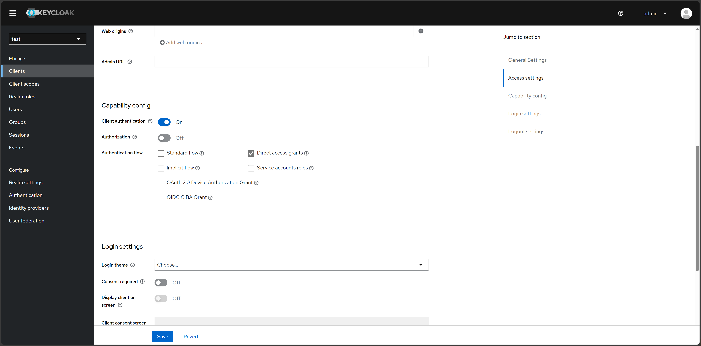</p>
<p align="center"><i>Enabling 2FA for AMQP protocol access using the Python package Pika.</i></p>

Then, make sure to assign your user the ```producer``` role. Navigate to "Users" > select a user > "Role mapping" > "Assign role" > check the "producer" option > click "Assign" button.

<p align="center">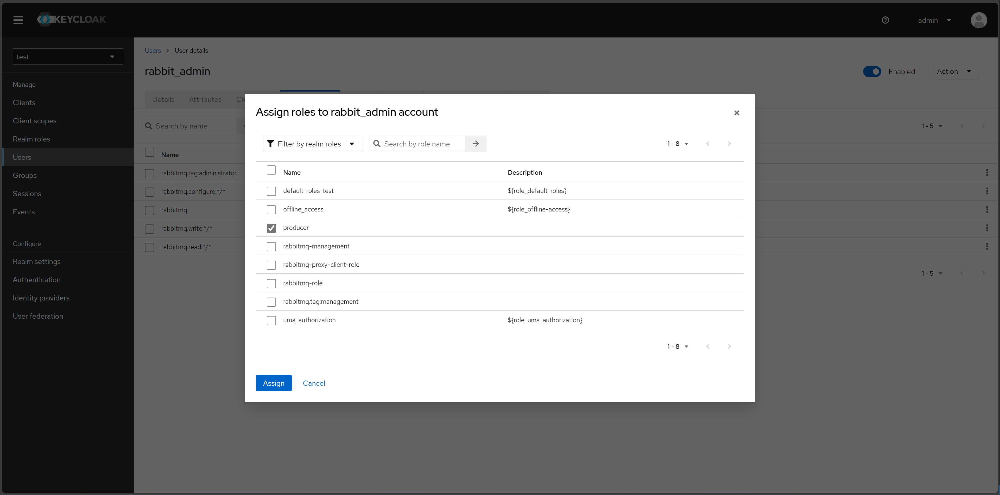</p>
<p align="center"><i>Assigning roles to a user to enable successful two-factor authentication (2FA) using Pika.</i></p>

You should now see the ```producer``` role under your user.

> **Note:**
> If you do not assign the ```producer``` role to your user, you will run into errors in subsequent sections of this tutorial. For example, you may see an error like the following: ```Access denied: ConnectionClosedByBroker: (530) "NOT_ALLOWED - access to vhost '/' refused for user '4cf4d6b5-09e5-453f-bf22-c8efdc2dd1dc'"```

<p align="center">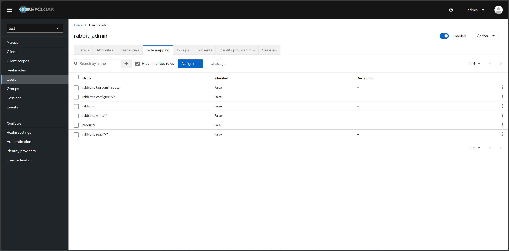</p>
<p align="center"><i>Assigned roles for a user to enable two-factor authentication (2FA) using Pika.</i></p>

### Using Pika Python Client to Access the AMQP Protocol

#### Secret key

The AMQP protocol can be accessed using the Pika Python client. A Python sample application that receives a token, uses the token to authenticate and publish AMQP messages, and refreshes the token on a live AMQP connection is provided [here](https://github.com/rabbitmq/rabbitmq-oauth2-tutorial/blob/main/pika-client/producer.py).

To run the Python sample application, run:

```bash
pip install pika requests
```

After installing the dependencies, you will need to obtain the client secret key. Ensure you are in the ```test``` realm. Navigate to "Clients" > "Credentials". In the "Client secret" section, you will find the client secret key.

<p align="center">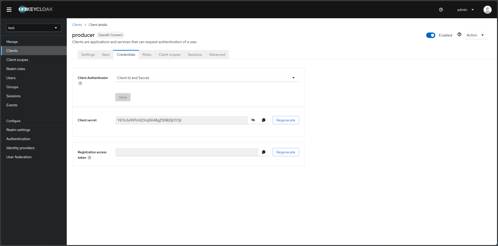</p>
<p align="center"><i>Retrieving the client secret key for a specific client in Keycloak.</i></p>

To set up a consumer (subscriber/receiver) sample application, run:

```bash
wget https://raw.githubusercontent.com/emmanuelgonz/rabbitmq_keycloak/main/scripts/receive.py
python3 receive.py producer kbOFBXI9tANgKUq8vXHLhT6YhbivgXxn 
```

Next, we will set up a producer (publisher) sample application using the client ID and client secret key you retrieved above in the following format: ```bash python3 send.py <client ID> <client secret key>```. For example, run:

```bash
https://raw.githubusercontent.com/emmanuelgonz/rabbitmq_keycloak/main/scripts/send.py
python3 send.py producer kbOFBXI9tANgKUq8vXHLhT6YhbivgXxn
```

#### Secret Key & 2FA Using One-Time Password

Previously, we set up an authenticator application, such as Google Authenticator or FreeOTP. In this Python sample application, we will use a client ID, client secret key, and OTP to authenticate a RabbitMQ client connection and publish messages.

To set up a consumer (subscriber/receiver) sample application, run:

```bash
wget https://raw.githubusercontent.com/emmanuelgonz/rabbitmq_keycloak/main/scripts/receive.py
python3 receive.py producer kbOFBXI9tANgKUq8vXHLhT6YhbivgXxn 
```

Next, we will set up a producer (publisher) sample application using the client ID, username, password, client secret key, and OTP. For example, run:

```bash
python3 send_2fa.py
```

For client secret key use: ```kbOFBXI9tANgKUq8vXHLhT6YhbivgXxn```.

You will need to enter your credentials and a OTP when prompted. Use the authenticator app you previously set up, such as Google Authenticator or FreeOTP.

<p align="center">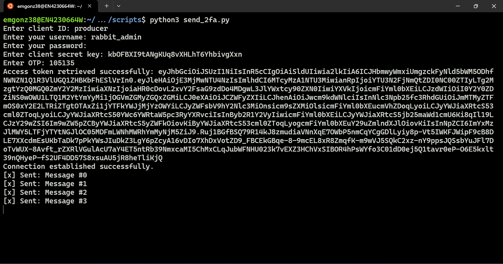</p>
<p align="center"><i>A producer (publisher) sample application requesting credentials and OTP.</i></p>

The application will automatically refresh the access token every 55 seconds, without the need for the user to re-authenticate.

<p align="center">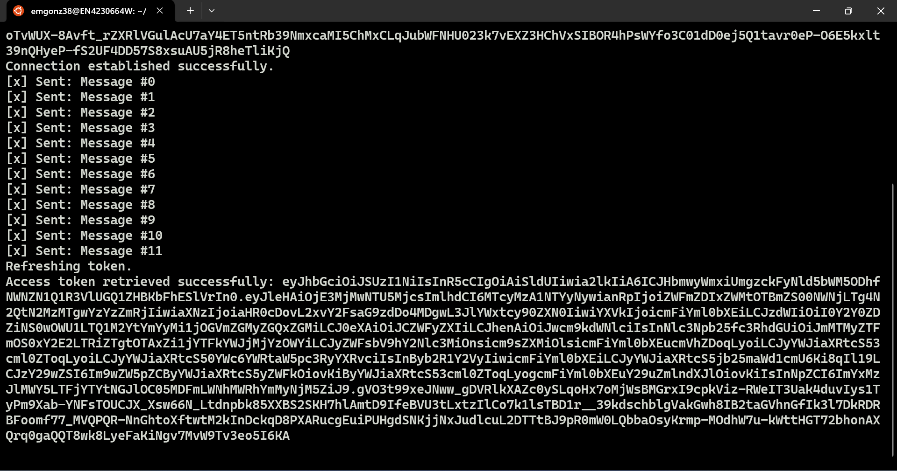</p>
<p align="center"><i>A producer (publisher) sample application refreshing access token after 55 seconds.</i></p>

## Frequently Asked Questions

1. 
    Q: I see the following error: ```Access denied: ConnectionClosedByBroker: (530) "NOT_ALLOWED - access to vhost '/' refused for user '4cf4d6b5-09e5-453f-bf22-c8efdc2dd1dc'"```. What could be going on?

    A: It is likely that you did not add the ```producer``` role to your user. Make sure to follow the [section](#configuring-user-roles-for-oauth-2.0-and-2fa)